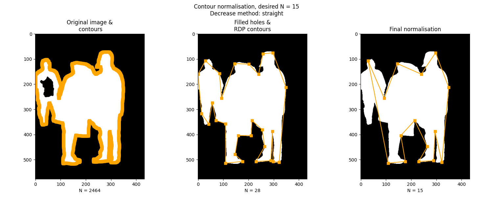

# Contour Nomalisation

## Pre-process & initial contour  
  
The binary mask image is read by OpenCV and any holes will be filled with scipy. Then, an initial set of contours will be generated using `cv2.findCountours()`. This is often a large set with continuous points highlighting the entire boundary of the object.   

In certain images, faulty contours may occur due to not all holes being filled or salt and peppers. Thus, a threshold is provided to remove any contours with minimal lengths. 


  
```python  
# read image  
og_img = cv2.imread(img_path)  
gray_image = cv2.cvtColor(og_img, cv2.COLOR_BGR2GRAY)  
  
# fill in any holes  
img = ndimage.binary_fill_holes(gray_image).astype(np.uint8)  
  
# get initial set of contours  
contours, hierarchy = cv2.findContours(img, cv2.RETR_TREE, cv2.CHAIN_APPROX_NONE)  

# threshold to remove faulty contours
max_contour_length = max([len(contour) for contour in contours])
contours = [contour for contour in contours if len(contour)>0.1*max_contour_length]

```  
  
## Ramer-Douglas-Peucker (RDP) algorithm  
### Divide the object boundary into two segments   
  
First, the centroid of each bounded object is computed by taking the mean of all the contour coordinates. With m the number of coordinates making up the initial contour. 
  
$$ G =\Big( \frac{(\sum x_i)}{m}, \frac{(\sum y_i)}{m}  \Big) $$   
  
First, two initial points are selected by choosing the point farthest from the centroid called `P1` and the point farthest from itself called `PN`. Both will be added to the normalised contour list. Using these two points, the initial contour can be separated into two curve segments, each starting and ending by these two points, respectively. RDP will then be performed on each of these segments. 

### RDP algorithm
RDP is simple yet powerful since it focuses on preserving the original shape of the curve. The algorithm works on a curve segment composed of points $(P_1, P_2, ..., P_N)$. With each point $(P_2, ..., P_{N-1})$, it computes the distance of said point to the line connected $(P_1, P_N)$. The point $P_i$ with the maximum distance is the largest deviance from the current curve segment. If the distance is larger than a pre-determined value $\epsilon$, said point $P_i$ is considered to be important to preserving the original shape, and added to the normalised contour. The curve segment is then divided at said $P_i$, each added to the `curve_segment_queue` to be processed as described. 

### Epsilon
At this point, we are introduced to the first limitation of the RDP algorithm, $\epsilon$. With smaller values of $\epsilon$, more contour points will be considered as it allows more granularity or focuses on fidelity to the original shape. On the contrary, large values of $\epsilon$ preserve fewer details, only the general outline of the original shape is kept. Thus, relying on the RDP algorithm alone does not ensure the normalised contour has the pre-determined length. 

By decreasing $\epsilon$ gradually, we can increase the contour length until a minimum of N is met.  If after $\epsilon$ reaches 0 and the pre-determined length N is still not met, then linear interpolation is applied. On the other hand, if the normalised length resulted to be above N, then further normalisation is applied. 
  
## Further decrease contour length   
There were three methods implemented for further decreasing contour length, each with its strengths and drawbacks. 

### Removing contour points from (relatively) straight segments

An intuitive way to further normalising contours is to use an inverse logic to that of RDP, that is, looking for segments with minimal change in angle and removing contour points within that area.   

For every three consecutive contour points $p_1$, $p_3$ and $p_2$, compute the distance between $p_3$ and the line connecting $(p_1, p_2)$. Ones with smaller distances are visually relatively straight, i.e. removal of $p_3$ will not lose much information on the original shape on the segment connecting $p_1$ and $p_2$.
This method performs generally well across examples with simple contour shapes.


However, it struggles in cases where multiple objects are clustered together or ones with more complicated. A big error in this approach is the statement that "Ones with smaller distances are visually relatively straight". This statement follows the assumption that the line segment is ordered $p_1$, $p_3$, and $p_2$. With $p_3$ spatially in between $p_1$ and $p_2$. However, this is not always true. Thus, in cases with crooks and crannies, this method can struggle to preserve the original shape. 




### Minimum angle 
This method, on the other hand, focuses on covering the entire original shape by removing contours at crooks and crannies. This is done by actually computing the angle bounded by $(p_1, p_3, p_2)$.


### Minimum consequence to total area 
Another way is removing points that have the least consequence on the total area of the enclosed shape after removal. The total area is computed on the original contour generated by `cv2.findContours` using the following formula, which was taken from the paper [1].  

$$ S =\frac{1}{2} \bigg |\sum_{i=0}^{m} x_iy_{i+1} - x_{i+1}y_i \bigg | $$

Then, with the normalised contour, each point is removed to see and total area is computed on the resulted contour to see how the removal of each affects the change in the area. One that results in the minimum change can be understood as inconsequential to the total area of the shape. 

While this approach performs fairly well across all examples, the definition of total area does not fully capture the shape of the enclosed object. 


## Increase contour length

After $\epsilon$ reaches zero, if the pre-determined length is still not met, the following simple algorithm is used to increase the contour length:
- For each pair of neighbouring contour points $p_1$ and $p_2$, get the distance between two points as well as the mean coordinates. 
$$ p_{middle} = \Big(\frac{p_{1x} + p_{2x}}{2}, \frac{p_{1y} + p_{2y}}{2} \Big) $$
-  From the mean coordinate, get the actual contour point from the original contour list that is closest to the mean coordinate.
$$ P_{middle} = \{ p_i \in \Gamma  | dist(p_i, p_{middle}) \leq dist(p_j, p_{middle}) \forall p_j \in \Gamma \} $$
- For the pair with the maximum distance, we check if $P_{middle}$ already exists in the normalised contour. If not, we add $P_{middle}$ to the normalised contour. If yes, we move on to the pair with the second most distance. 


## Failed attempts

### Object Area Normalisation (OAN)

An implementation of OAN described by Paramarthalingam et al. was attempted[1]. This algorithm is fairly intuitive and quite robust in terms of ensuring the normalised contour has the pre-determined shape of N. 

It involves dividing the shape into N sectors, each with an area of $S_{part}$, where S is the total area, and N is the desired length of the normalised contour.
$$ S_{part} = \frac{S}{N} $$

By traversing along the contour, at some contour point $p_i$, if the traversed area has the sector area equivalent $S_{part}$, we add said point to the normalised contour and start a new sector. 

A major drawback of this approach is that it does not take into consideration the extreme points of the enclosed shape. In the below case, we would lose the right shoulder. 


# Reference 
[1] Paramarthalingam, Arjun & T. T, Mirnalinee. (2020). Extraction of compact boundary normalisation-based geometric descriptors for affine invariant shape retrieval. Image Processing, IET. 15. 1093–1104. 10.1049/ipr2.12088. 
